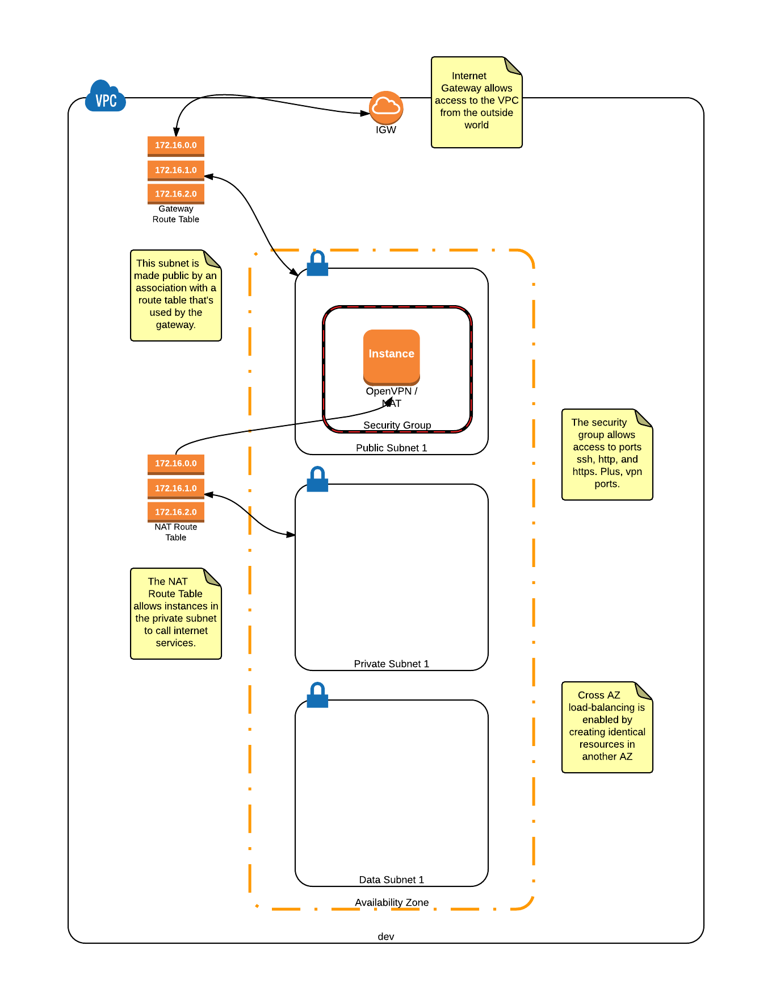

## Before we begin

### Create a `secrets.tf` file in the root of this project

Here is an example:

```
variable "aws" {
  default = {
    access_key = "[AWS ACCESS KEY]"
    secret = "[AWS SECRET]"
    key_name = "[NAME OF PRECONFIGURED AWS KEY]"
    private_key_path = "[LOCATION OF PRIVATE KEY]"
    hosted_zone_id = "[ZONE ID OF PRECONFIGURED ROUTE53 ZONE]"
    office_cidr = "[CIDR OF YOUR COMPUTER OR NETWORK OUTSIDE OF AWS]"
    region = "us-east-1"
  }
}
```
### Make sure `terraform` is installed and available in your shell


## Getting Started

Assuming we're starting with an empty AWS environment, we'll want to establish our private network.  This network will allow us to control which resources are reachable by the general public, while keeping backend resources secure and inaccessible to the general public.

`terraform apply`

That command will create the following environment:



## Configuring OpenVPN server

SSH into the vpn server
Per the [OpenVPN Quick Start Guide](https://openvpn.net/index.php/access-server/docs/quick-start-guide.html)

`ssh -i [CERT].pem openvpnas@[SERVERIP]`

Then, change the admin password

`passwd openvpnas`

You will be prompted to set the password.  Afterwards, you can access the Web UI to configure user accounts.
